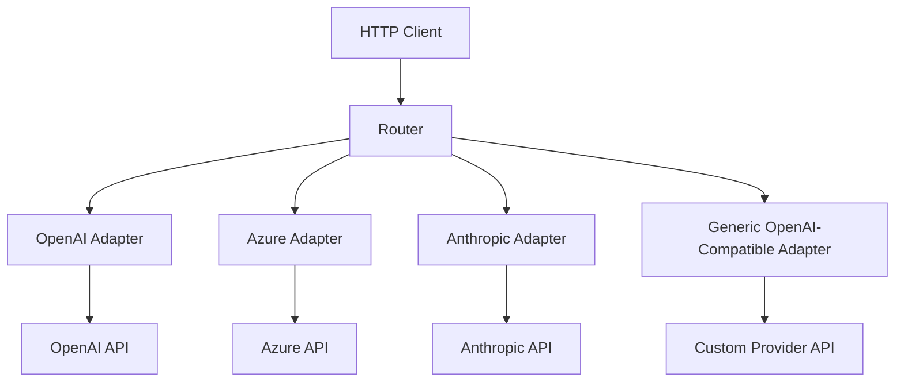
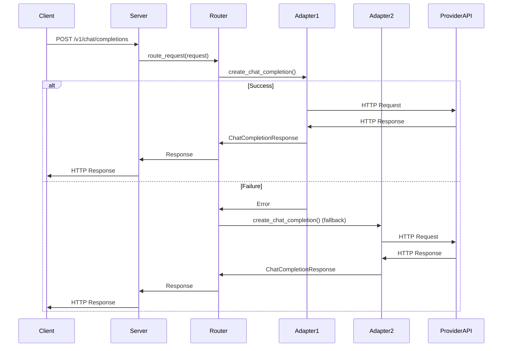

# Claude Code Proxy - Rust Implementation Architecture

## Overview

This document details the actual Rust implementation architecture of the Claude Code Proxy, which is the primary production-ready implementation. The Rust proxy provides a robust, high-performance gateway that translates Anthropic's Messages API to OpenAI-compatible and Azure Chat Completions providers.

## Key Requirements

1. **Adapter Pattern**: Support multiple LLM providers (OpenAI, Azure, Anthropic, etc.)
2. **Smart Routing**: Route requests based on model availability, cost, latency
3. **Auto-Fallback**: Automatic fallback to alternative providers on failure
4. **OpenAI Compatibility**: Support OpenAI-compatible APIs with variations
5. **Performance**: High throughput, low latency, async I/O
6. **Reliability**: Robust error handling, retries, circuit breaking

## Architecture Overview



## Core Components

### 1. Adapter Trait (Interface)

```rust
pub trait LLMAdapter: Send + Sync {
    /// Get adapter metadata
    fn metadata(&self) -> &AdapterMetadata;
    
    /// Check if adapter can handle a specific model
    fn supports_model(&self, model: &str) -> bool;
    
    /// Get current status (healthy, degraded, unavailable)
    async fn status(&self) -> AdapterStatus;
    
    /// Create chat completion
    async fn create_chat_completion(
        &self,
        request: ChatCompletionRequest,
        context: RequestContext,
    ) -> Result<ChatCompletionResponse, AdapterError>;
    
    /// Create streaming chat completion
    async fn create_chat_completion_stream(
        &self,
        request: ChatCompletionRequest,
        context: RequestContext,
    ) -> Result<Pin<Box<dyn Stream<Item = Result<ChatCompletionChunk, AdapterError>> + Send>>, AdapterError>;
    
    /// Cancel ongoing request
    fn cancel_request(&self, request_id: &str) -> bool;
}
```

### 2. Provider-Specific Adapters

#### OpenAI Adapter
```rust
pub struct OpenAIAdapter {
    client: reqwest::Client,
    api_key: String,
    base_url: String,
    metadata: AdapterMetadata,
    rate_limiter: RateLimiter,
}
```

#### Azure Adapter
```rust
pub struct AzureAdapter {
    client: reqwest::Client,
    api_key: String,
    endpoint: String,
    deployment: String,
    api_version: String,
    metadata: AdapterMetadata,
}
```

#### Generic OpenAI-Compatible Adapter
```rust
pub struct GenericOpenAIAdapter {
    client: reqwest::Client,
    api_key: String,
    base_url: String,
    metadata: AdapterMetadata,
    // Custom header mappings
    header_mappings: HashMap<String, String>,
}
```

### 3. Smart Router

```rust
pub struct SmartRouter {
    adapters: Vec<Arc<dyn LLMAdapter>>,
    config: RouterConfig,
    metrics: RouterMetrics,
    health_checker: HealthChecker,
}

impl SmartRouter {
    pub async fn route_request(
        &self,
        request: ChatCompletionRequest,
    ) -> Result<ChatCompletionResponse, RouterError> {
        // 1. Filter adapters that support the requested model
        // 2. Sort by priority, cost, latency, health status
        // 3. Try primary adapter
        // 4. Auto-fallback on failure
        // 5. Return response or aggregate errors
    }
}
```

### 4. Auto-Fallback Strategy

```rust
enum FallbackStrategy {
    /// Try adapters in priority order
    PriorityOrder,
    /// Try fastest responding adapter
    LowestLatency,
    /// Try cheapest adapter first
    LowestCost,
    /// Try all adapters concurrently, return first success
    Race,
}

struct FallbackConfig {
    strategy: FallbackStrategy,
    max_retries: usize,
    timeout: Duration,
    circuit_breaker: CircuitBreakerConfig,
}
```

### 5. Configuration Management

```rust
struct Config {
    server: ServerConfig,
    providers: HashMap<String, ProviderConfig>,
    routing: RoutingConfig,
    fallback: FallbackConfig,
    rate_limiting: RateLimitingConfig,
    monitoring: MonitoringConfig,
}

struct ProviderConfig {
    type: ProviderType, // OpenAI, Azure, Generic, etc.
    api_key: String,
    endpoint: String,
    models: Vec<String>,
    priority: u32,
    cost_per_token: f64,
    rate_limit: Option<RateLimit>,
}
```

## File Structure

```
src/
├── main.rs                  # Entry point
├── config/                  # Configuration
│   ├── mod.rs               # Config module
│   ├── settings.rs          # Settings structures
│   └── loader.rs            # Config file loader
├── adapter/                 # Adapter implementations
│   ├── mod.rs               # Adapter module
│   ├── trait.rs             # LLMAdapter trait
│   ├── openai.rs            # OpenAI adapter
│   ├── azure.rs             # Azure adapter
│   ├── anthropic.rs         # Anthropic adapter
│   ├── generic.rs           # Generic OpenAI-compatible
│   └── metadata.rs          # Adapter metadata
├── router/                  # Routing logic
│   ├── mod.rs               # Router module
│   ├── smart.rs             # Smart router
│   ├── fallback.rs          # Fallback strategies
│   └── health.rs            # Health checking
├── models/                  # Data models
│   ├── mod.rs               # Models module
│   ├── request.rs           # Request models
│   ├── response.rs          # Response models
│   └── conversion.rs        # Model conversion
├── server/                  # HTTP server
│   ├── mod.rs               # Server module
│   ├── api.rs               # API endpoints
│   ├── state.rs            # Server state
│   └── middleware.rs        # Middleware
├── error.rs                 # Error handling
├── metrics.rs              # Metrics collection
└── utils/                   # Utilities
    ├── rate_limiter.rs      # Rate limiting
    └── circuit_breaker.rs   # Circuit breaker
```

## Data Flow

### Request Processing



## Key Features

### 1. Adapter Pattern

- **Standardized Interface**: All adapters implement `LLMAdapter` trait
- **Easy Extensibility**: Add new providers by implementing the trait
- **Provider Isolation**: Each adapter handles its own authentication and API quirks

### 2. Smart Routing

- **Model-Based Routing**: Route to adapters that support the requested model
- **Priority-Based**: Respect configured provider priorities
- **Cost-Optimized**: Route to cheapest available provider
- **Latency-Optimized**: Route to fastest responding provider

### 3. Auto-Fallback

- **Multiple Strategies**: Priority order, race condition, cost-based, latency-based
- **Circuit Breaker**: Fail fast when provider is down
- **Retry Logic**: Configurable retry counts and timeouts
- **Error Aggregation**: Collect errors from multiple attempts

### 4. OpenAI Compatibility

- **Generic Adapter**: Handles OpenAI-compatible APIs with variations
- **Header Mapping**: Custom header support for different providers
- **Endpoint Customization**: Flexible endpoint configuration

### 5. Performance & Reliability

- **Async I/O**: Tokio runtime for high concurrency
- **Connection Pooling**: Reuse HTTP connections
- **Rate Limiting**: Per-provider rate limiting
- **Circuit Breakers**: Prevent cascading failures
- **Health Checks**: Periodic provider health monitoring

## Implementation Details

### Adapter Implementation Example

```rust
// OpenAI Adapter Implementation
pub struct OpenAIAdapter {
    client: Client,
    api_key: String,
    base_url: String,
    metadata: AdapterMetadata,
}

#[async_trait::async_trait]
impl LLMAdapter for OpenAIAdapter {
    fn metadata(&self) -> &AdapterMetadata {
        &self.metadata
    }
    
    fn supports_model(&self, model: &str) -> bool {
        self.metadata.supported_models.contains(model)
    }
    
    async fn status(&self) -> AdapterStatus {
        // Check API health
        // Return healthy, degraded, or unavailable
    }
    
    async fn create_chat_completion(
        &self,
        request: ChatCompletionRequest,
        context: RequestContext,
    ) -> Result<ChatCompletionResponse, AdapterError> {
        // Convert to OpenAI format
        // Make HTTP request
        // Convert response
        // Handle errors
    }
}
```

### Router Implementation

```rust
impl SmartRouter {
    pub async fn route_request(
        &self,
        request: ChatCompletionRequest,
    ) -> Result<ChatCompletionResponse, RouterError> {
        // 1. Filter adapters that support the model
        let candidates = self.filter_adapters(&request);
        
        // 2. Apply routing strategy
        let ranked = self.rank_adapters(candidates, &request).await;
        
        // 3. Execute with fallback
        self.execute_with_fallback(ranked, request).await
    }
    
    async fn execute_with_fallback(
        &self,
        adapters: Vec<Arc<dyn LLMAdapter>>,
        request: ChatCompletionRequest,
    ) -> Result<ChatCompletionResponse, RouterError> {
        match self.config.fallback.strategy {
            FallbackStrategy::PriorityOrder => {
                self.try_sequential(adapters, request).await
            }
            FallbackStrategy::Race => {
                self.try_concurrent(adapters, request).await
            }
            // ... other strategies
        }
    }
}
```

## Error Handling

```rust
#[derive(Debug, thiserror::Error)]
pub enum AdapterError {
    #[error("API request failed: {0}")]
    RequestFailed(String),
    
    #[error("Authentication failed: {0}")]
    AuthenticationFailed(String),
    
    #[error("Rate limit exceeded")]
    RateLimited,
    
    #[error("Model not supported: {0}")]
    ModelNotSupported(String),
    
    #[error("Provider unavailable")]
    Unavailable,
    
    #[error("Timeout")]
    Timeout,
    
    #[error("Unknown error: {0}")]
    Unknown(String),
}

#[derive(Debug, thiserror::Error)]
pub enum RouterError {
    #[error("No available adapters for model: {0}")]
    NoAdaptersAvailable(String),
    
    #[error("All adapters failed")]
    AllAdaptersFailed(Vec<AdapterError>),
    
    #[error("Routing timeout")]
    Timeout,
    
    #[error("Invalid request: {0}")]
    InvalidRequest(String),
}
```

## Monitoring & Metrics

```rust
pub struct RouterMetrics {
    requests_total: Counter,
    requests_by_provider: Family<Counter, String>,
    request_latency: Histogram,
    errors_total: Counter,
    errors_by_type: Family<Counter, String>,
    fallback_attempts: Counter,
    active_requests: Gauge,
}
```

## Configuration Example (YAML)

```yaml
server:
  host: 0.0.0.0
  port: 8082
  workers: 8

providers:
  - name: "openai-primary"
    type: "openai"
    api_key: "sk-..."
    endpoint: "https://api.openai.com/v1"
    models: ["gpt-4", "gpt-4o", "gpt-3.5-turbo"]
    priority: 1
    cost_per_token: 0.00001
    rate_limit:
      requests: 1000
      interval: 60

  - name: "azure-fallback"
    type: "azure"
    api_key: "..."
    endpoint: "https://my-azure-resource.openai.azure.com"
    deployment: "gpt-4-deployment"
    api_version: "2024-02-15-preview"
    models: ["gpt-4", "gpt-35-turbo"]
    priority: 2
    cost_per_token: 0.000008

  - name: "local-ollama"
    type: "generic"
    api_key: "dummy"
    endpoint: "http://localhost:11434/v1"
    models: ["llama3:70b", "llama3:8b"]
    priority: 3
    cost_per_token: 0.0

routing:
  default_provider: "openai-primary"
  fallback:
    strategy: "priority_order"
    max_retries: 3
    timeout_ms: 5000
```

## Migration from Python to Rust

### Key Differences

1. **Type Safety**: Rust's strong type system vs Python's dynamic typing
2. **Async Runtime**: Tokio vs Python's asyncio
3. **Error Handling**: Result type vs exceptions
4. **Memory Management**: Ownership model vs garbage collection
5. **Concurrency**: Fearless concurrency vs GIL

### Advantages of Rust Implementation

1. **Performance**: Lower latency, higher throughput
2. **Memory Safety**: No GC pauses, predictable performance
3. **Concurrency**: Better utilization of multi-core systems
4. **Reliability**: Compiler-enforced error handling
5. **Deployment**: Single binary, no Python runtime dependencies

### Challenges

1. **Complexity**: More boilerplate code
2. **Learning Curve**: Rust's ownership model
3. **Ecosystem**: Smaller ecosystem than Python for AI/ML
4. **Development Speed**: Slower iteration cycle

## Implementation Roadmap

### Phase 1: Core Architecture
- [ ] Define adapter trait and basic structures
- [ ] Implement OpenAI adapter
- [ ] Implement generic adapter
- [ ] Basic router with priority-based routing
- [ ] Simple HTTP server with one endpoint

### Phase 2: Advanced Features
- [ ] Add Azure and Anthropic adapters
- [ ] Implement fallback strategies
- [ ] Add health checking and circuit breakers
- [ ] Implement rate limiting
- [ ] Add monitoring and metrics

### Phase 3: Production Readiness
- [ ] Comprehensive error handling
- [ ] Configuration management
- [ ] Logging and observability
- [ ] Documentation
- [ ] Testing (unit, integration, load)

### Phase 4: Optimization
- [ ] Performance tuning
- [ ] Connection pooling
- [ ] Caching layer
- [ ] Load shedding

## Conclusion

This Rust-based architecture provides a robust foundation for a multi-provider LLM proxy with:
- Clean adapter pattern for extensibility
- Smart routing for optimal performance
- Auto-fallback for reliability
- Strong type safety and memory safety
- High performance and concurrency

The design balances flexibility with maintainability, allowing easy addition of new providers while ensuring reliable operation through comprehensive error handling and fallback mechanisms.
